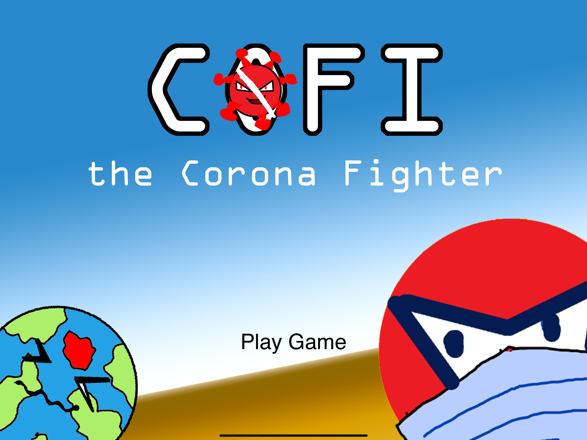
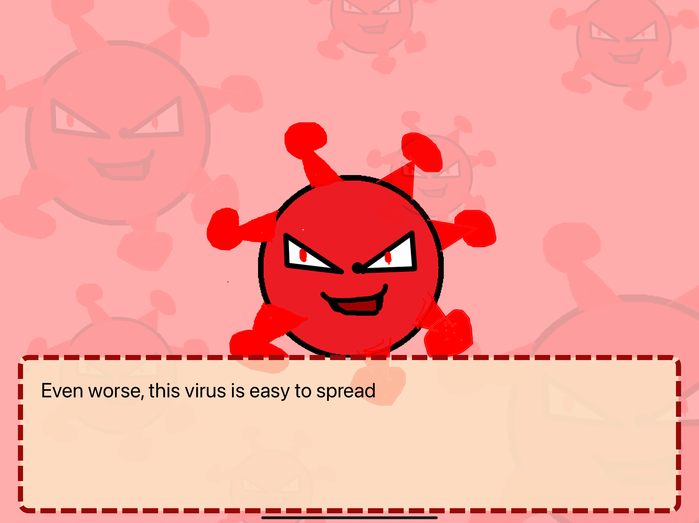
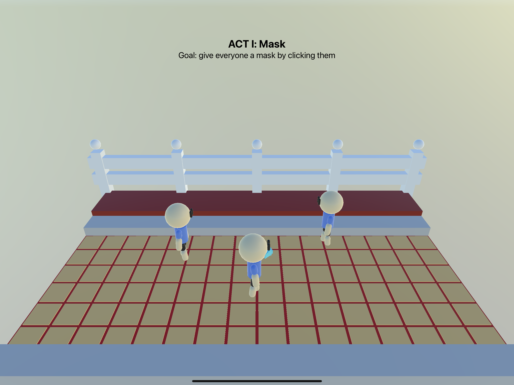
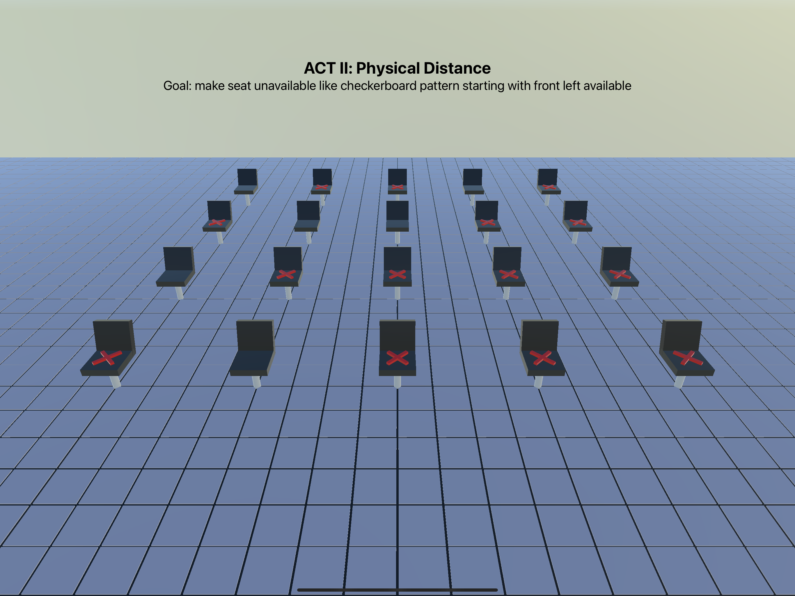
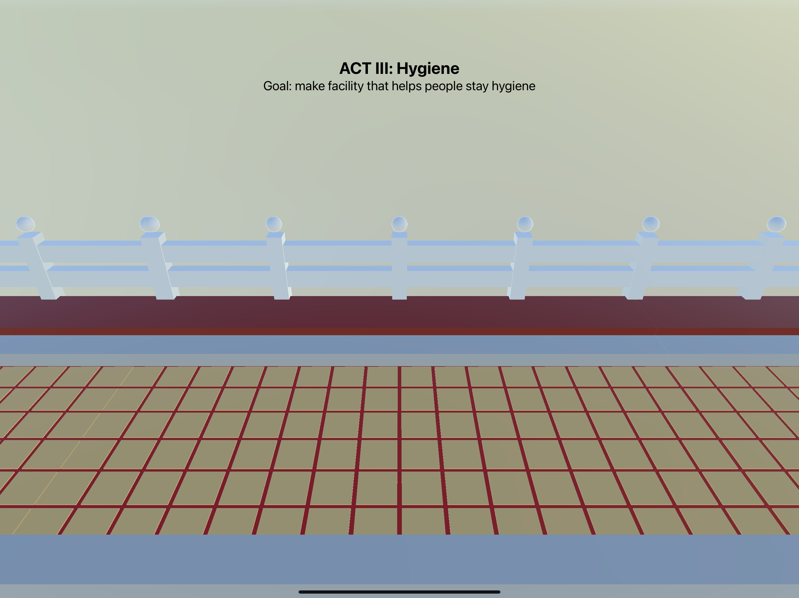

# Cofi: Corona Fighter
__Cofi: Corona Fighter__ is an education game for my [WWDC 2022 Swift Student Challenge](https://developer.apple.com/wwdc22/swift-student-challenge/) Submission. And I'm very grateful that this game makes me __1__ of __350__ [WWDC Scholarship](https://www.wwdcscholars.com/2022) winner for the second time (woooo 🥳)

My WWDC Profile: [>> Portal <<](https://www.wwdcscholars.com/s/0A052450-0317-4FAF-A493-B4F9A4AE1771)

## About Cofi
__Cofi__ is an educational game about fighting the latest disease called [COVID-19](https://en.wikipedia.org/wiki/COVID-19). With this game, players can learn to fight COVID-19 in a fun and engaging way. This game itself will be divided into three parts. Each part of this game will educate players on how to prevent the spread of this disease.

As we all know, COVID-19 is a disease that has existed since December 2019 and is still spreading around the world. To prevent the spread of this disease, scientists created health protocols. However, this disease continues to spread. It turns out that the cause of the spreading is none other than the lack of public awareness of this disease.

By Making this game, I hope the public awareness of COVID-19 will increase so that we can stop this disease once and for all.

## Technologies
- __Swift__ - Programming Language
- __SwiftUI__ - UI Framework
- __SceneKit__ - 3D Graphics Framework
- __Combine__ - Transfering data between views [reactively](https://en.wikipedia.org/wiki/Reactive_programming)

## How to Run
### Mac ([Xcode](https://developer.apple.com/xcode/))
1. Download / Clone this repository
2. Open __wwdc22.swiftpm__ in XCode using "Open With"
3. Change simulator to iPad devices
4. Run the project
### iPad ([Swift Playground](https://www.apple.com/swift/playgrounds/))
1. Download this repository
2. Open __wwdc22.swiftpm__ in Swift Playground

## Preview

